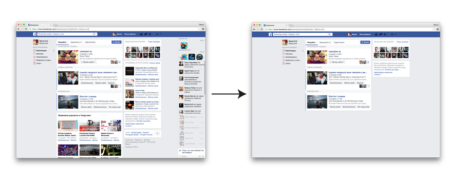

# Less is more

Facebook contains way too much unneccessary content which distracts you from what you really want to find. Events page for instance? Can you even spot your events among all this, *proposed*, *nearby*, *friends'* and more? I couldn't. Do you really care that the step-niece of your friend's friend attends an event in the area?

This is why I created this Chrome extension. *Less is more* works a bit like AdBlock but it doesn't stop at ads. It removes multiple sections of the portal leaving you with only the most important and useful features. 

See how it works:

## Installation

**I plan to add this extension to the official Chrome store in the future.** In the meantime you will need to install it manually.

1. Clone the repo or download using the green "Clone or download" button.
2. Unzip the archive in some safe and place.
3. Go to [chrome://extensions/](chrome://extensions/).
4. You may need to tick the "Developer mode" on the top right.
5. Click the "Load unpacked extension..." button and indicate the location of the files.
6. Done! If you had facebook page already opened refresh it.

